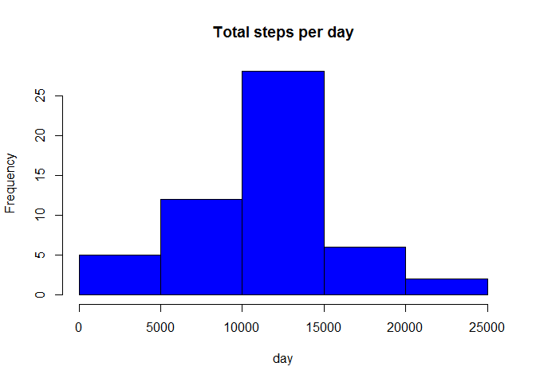
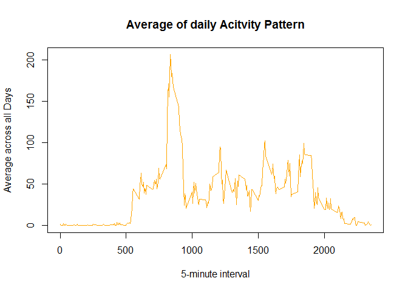
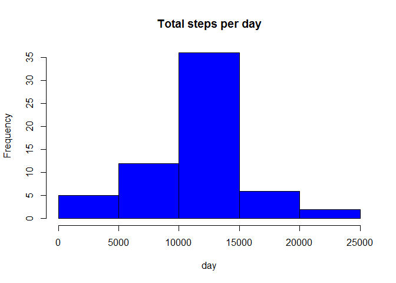
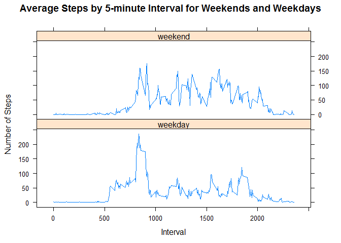

# Reproducible Research: Peer Assessment 1


## Loading and preprocessing the data  

> Assuming the file is in current direcory  


```r
   activity <- read.csv("activity.csv", colClasses = c("numeric", "character", "numeric"))
```

> Use agrregate function to get the required data  
> Create histogram   

## What is mean total number of steps taken per day?  


```r
      library(lattice)
      activity$date <- as.Date(activity$date, "%Y-%m-%d")
```

> Create histogram    


```r
        StepsperDay <- aggregate(steps ~ date, data = activity, sum, na.rm = TRUE)
        hist(StepsperDay$steps, main = "Total steps per day", xlab = "day", col = "Blue")
```

 
> Mean and the Median 

    
    
    ```r
        mean(StepsperDay$steps)
    ```
    
    ```
    ## [1] 10766.19
    ```
    
    ```r
        median(StepsperDay$steps)
    ```
    
    ```
    ## [1] 10765
    ```

## What is the average daily activity pattern?
> Make plot of interval (x axis) and the average number of steps taken, averaged across all
> days (y-axis)  


```r
      activitypattern <- tapply(activity$steps, activity$interval, mean, na.rm = TRUE)
      plot(row.names(activitypattern), activitypattern, type = "l", xlab = "5-minute interval", 
      ylab = "Average across all Days", main = "Average of daily Acitvity Pattern", 
     col = "orange")
```

 


>  Which 5-minute interval, on average across all the days in the dataset, contains the maximum >  number of steps?.      


```r
      max_steps <- which.max(activitypattern)
      names(max_steps)
```

```
## [1] "835"
```

## Imputing missing values.  

> the total number of rows with NAs  

    
    ```r
        activity_NA <- sum(is.na(activity))
        activity_NA
    ```
    
    ```
    ## [1] 2304
    ```
    
> Devise a strategy for filling in all of the missing values in the dataset.

> The strategy does not need to be sophisticated. For example, you could use the mean/median
> for  that day, or the mean for that 5-minute interval,etc    
> Missing data -Na replaced by mean in 5 min interval.    


```r
      AverageVal <- aggregate(steps ~ interval, data = activity, FUN = mean)
      fillNA <- numeric()
        for (i in 1:nrow(activity)) {
            obs <- activity[i, ]
            if (is.na(obs$steps)) {
                steps <- subset(AverageVal, interval == obs$interval)$steps
            } else {
              steps <- obs$steps
    }
      fillNA <- c(fillNA, steps)
}
```
> Missing Data -Create new dataset  with missing data filled with mean value.  


```r
    new_data <- activity
    new_data$steps <- fillNA    
```
> Calculate and report the mean and median total number of steps taken per day.  


```r
      RevisedStepsperDay<- aggregate(steps ~ date, data = new_data, sum, na.rm = TRUE)
```
> New The Histogram  


```r
    hist(RevisedStepsperDay$steps, main = "Total steps per day", xlab = "day", col = "Blue")
```

 

> Revised Mean and Median.  


```r
      mean(RevisedStepsperDay$steps)
```

```
## [1] 10766.19
```

```r
      median(RevisedStepsperDay$steps)
```

```
## [1] 10766.19
```
## Are there differences in activity patterns between weekdays and weekend.  

> Create a new variable for indicating if a date falls on weekends or weekdays.  


```r
    day <- weekdays(activity$date)
    dayIndicator <- vector()
    for (i in 1:nrow(activity)) {
      if (day[i] == "Saturday") {
          dayIndicator[i] <- "Weekend"
      } else if (day[i] == "Sunday") {
          dayIndicator[i] <- "Weekend"
      } else {
          dayIndicator[i] <- "Weekday"
      }
    }
        activity$dayIndicator <- dayIndicator
        activity$dayIndicator <- factor(activity$dayIndicator)

        dayPatterns <- aggregate(steps ~ interval + dayIndicator, data = activity, mean)
        names(dayPatterns) <- c("interval", "dayindicator", "steps")
```


> Panel plot containing a time series plot of the 5-minute interval (x-axis).
> and the average number of steps taken, averaged across all weekday days or weekend days.
> (y-axis).  


```r
     xyplot(steps ~ interval | dayIndicator,dayPatterns, main="Average Steps per Day",type = "l",  xlab = "Interval", ylab = "Number of steps",layout = c(1, 2) )
```

 
